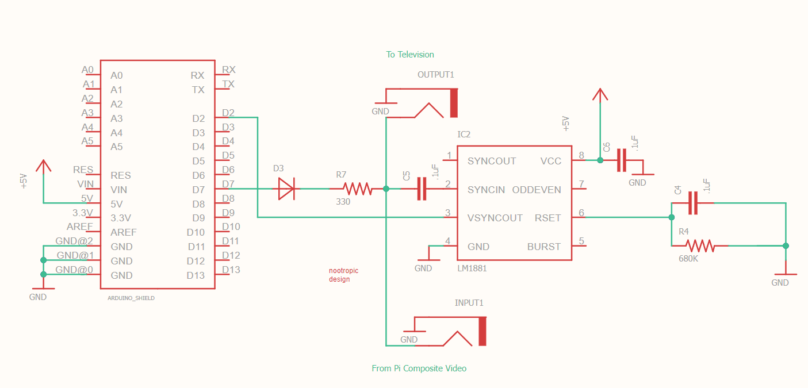

# PiClosedCaptions
A system for sending a closed captions signal over the raspberry pi's composite video signal

Heres a crappy trailer I made:
[Pi Closed Caption Trailer](https://youtu.be/cdE49kMk9UQ)
## Hardware Overview
This system was developed using an arduino with the [Video Experimenter Shield](https://nootropicdesign.com/video-experimenter/) by [nootropic designs](https://github.com/nootropicdesign) which has tons of great features and can enable you to do lots of interesting things with composite video signals on arduino.

However, the minimal hardware that is needed to run this project is an arduino, an LM1881 sync separator chip, a diode, and a few resistors and capacitors.


The arduino firmware is based off of a fork of the [Enhanced TVOut Library](https://github.com/TheLooseArrow/arduino-tvout-ve) that needs to be installed before compiling and uploading the arduino sketch in this repository.

The only other piece of hardware needed is a raspberry pi, or any other computer with a python interpreter and a composite video output (theoretically, I have only ever tried it with a raspberry pi)

This was designed only to work with an NTSC video signal by transmitting the closed captions using the [EIA-608](https://en.wikipedia.org/wiki/EIA-608) closed captioning standard.

## Software Overview
The software portion consists of some python scripts which parse an SRT subtitle file, plays a movie file, then sends the closed caption data to the arduino at the correct time in sync with the movie. 

As of now the scripts only supports SRT subtitles and any video file format that is supported by VLC media player.

These scripts were written using Python 3.7
### Pi Closed Captions
This script is where all the magic happens, it will play the movie and send the captions to the TV just like the glory days of analog home video.
#### Usage Instructions
```bash
python3 PiClosedCaptions.py [-h] [-s SUBFILE] [-m MOVIEFILE] [-c COMPORT] [-t STARTTIME]
```
Once the movie starts playing it can be stopped by simply pressing enter on the terminal that is running the script. The next subtitle to be displayed will be printed to the terminal as well.

This script has a few dependencies which can be found in the ```requirements.txt``` file. These dependencies can be installed using:
```bash
pip3 install -r requirements.txt
```
*Note: The ```python-vlc``` library requires VLC to be installed on the system. This can be done by running the following command:* 
```bash
apt install vlc
```
### Check SRT Encoding
This script will check the SRT subtitle file for encoding and formatting problems.
#### Usage Instructions
```bash
python3 CheckSRTEncoding.py -s <subtitle file>
```
The EIA-608 closed captioning standard only supports a subset of the ASCII encoding scheme with a few of the lesser used characters swapped out for ones that might be more likely to be encountered while captioning. The replacement characters are letters with accents mainly used in spanish and french.

The script will parse through the SRT file and check that it contains only supported characters. If there are any unsupported characters it will output the line numbers which have the problem along with the offending text

To fix these problems you can either get another version of the subtitles and hope it doesn't contain weird characters, you can go to each line and fix it yourself with a text editor, or you can enhance the script so you can fix it on the fly.

There is a function called ```fix_encoding``` in CheckSRTEncoding.py that will replace known characters of alternate encoding with supported characters. The intention was to update this function as needed when running into encoding issues on the subtitle files.

For example there are some files that use a musical note character (0xE299AA in extended unicode) which is not a supported character encoding, but ```fix_encoding``` will replace it with a the closed caption version which is supported (0x1137 in EIA-608)

The main CheckSRTEncoding.py script will also check for styling that may be present in the subtitle files such as italics, bold and underlined text.  In the SRT subtitling format the styling is expressed with HTML-like tags. For example italics are expressed as ```<i>…</i>``` or ```{i}…{/i}```.

Closed captions can only support italics and underlined text, and as of now the script can only convert the italics with the with the HTML tags (```<>``` not ```{}```) to EIA-608 format.

When cheking a file, it will inform the user if there are unsuppored formatting codes detected.

Lastly but not leastly, the main script will also check the length of each line of subtitles.  Closed captions on NTSC televisions can only support 32 characters per line.

The only way to fix this easily (besides finding alternate subtitles that are formatted correctly) is to use subtitle editing software of which there are many free and feature packed options for reformatting SRT subtitles.

## References
FCC regulations and requirements for closed captions in the United States:
- https://www.govinfo.gov/content/pkg/CFR-2007-title47-vol1/pdf/CFR-2007-title47-vol1-sec15-119.pdf

Wikipedia entry for EIA-608 closed captioning standard:
- https://en.wikipedia.org/wiki/EIA-608
